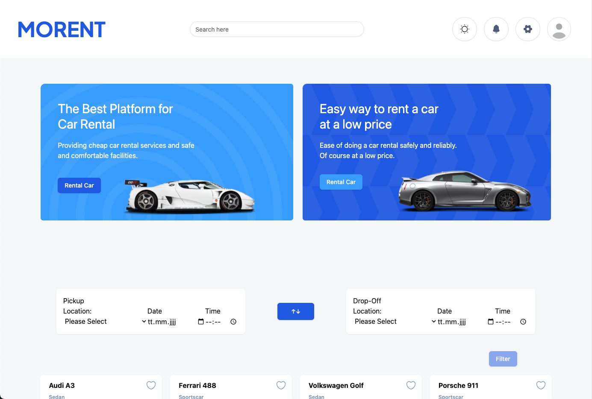
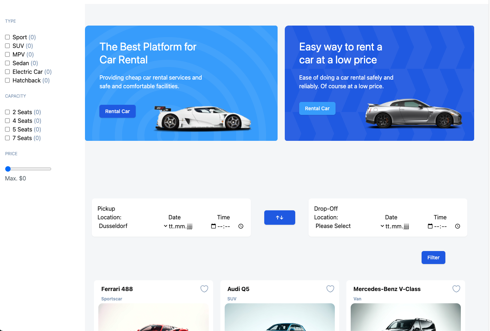
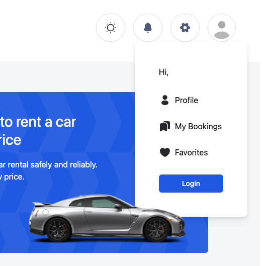
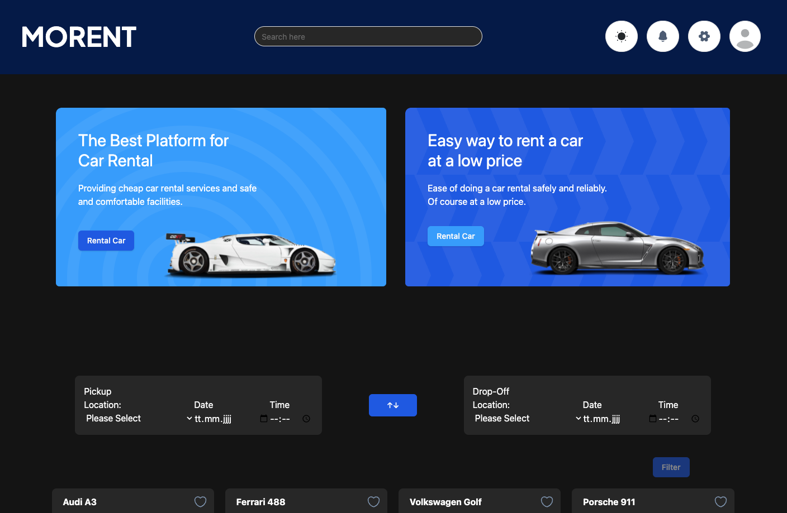

# Morent - Car rental 🏎️

  

 
As a team of three, we've created a dynamic car rental platform that caters to the diverse needs of our users. 
Our project is a web application designed to revolutionize the car rental experience. Users can easily search for available vehicles across Germany, filter results based on their specific needs, and book rentals with just a few clicks. With features like city-to-city rentals and advanced search filters, our platform offers a convenient and flexible solution for travelers and locals alike.

## Table of Contents 📑

- [Deployment](#deployment)
- [Demo](#demo)
- [Features](#features)
- [Tech Stack](#tech-stack)
- [Getting Started](#getting-started)
- [Usage](#usage)
- [Database](#database)
- [API Integration](#api-integration)
- [Authentication](#authentication)
- [Backend Routes](#backend-routes)
- [Design](#design)
- [Libraries & Tools](#libraries--tools)
- [Contributors](#contributors)

## Deployment

The "Morent" project is deployed using Netlify, making it easily accessible to everyone.

### Demo
The live version of our Website  can be accessed here: 
[Our Website](https://project-morent-car-rental.netlify.app/)

## Features
We used React and Node.js to build a robust and scalable application.

### Filter

  

 
 Search for rental cars in cities across Germany.
 Rent your favorite Car in on City and drop off in another!
We hade dvanced search filters integried: Refine your search by vehicle type, price, and CAPACITY.

### Profil Dropdown

  

 
In your profile, you can easily access your booking history, saved favorite cars, and update your personal details.
 
 ### Fovorites
 bla bla
 hier bild von einzeln Favorisierten Cards einfügen

 bla bla
 hier bild von Favoriten Page anzeigen

 ### My Bookings
 bla bla
 hier bild von Bookingpage einfügen

### Payment

  

 
Bla bla payment page

### Darkmode

  

 
For added comfort, we've included a dark mode option, easily accessible from the header. This eye-friendly feature reduces strain on your eyes, making your browsing experience more pleasant.

## Tech Stack

 

  
 

## Getting Started

## Usage

## Database

### API Integration

### Authentication

### Backend Routes

## Design

## Libraries & Tools

The Morent Web-App uses the following third-party libraries:
- `jsonwebtoken` - An implementation of JSON Web Tokens.
- `react-router-dom` - DOM bindings for React Router.
- `shadcn` - Is a Librarie for CSS Components coded with Tailwind.
- `bla`- For the Map Components
- `TanStack Query v5` - Used for Fetches, Loading and Loding-error-handle

## Contributors

Special thanks to the following contributors for their hard work on this project:

- [Robin Stumpf](https://github.com/robin160401) - Backend Developer, Tailwind-Master & Frontend Developer
- [Steve Dwumah](https://github.com/SteveDwumah) - Backend Developer, Features & Frontend Developer
- [Anne-Sophie Nehls](https://github.com/Anne-SophieNehls) - Frontend Developer, Trellomaster & Git Master

Feel free to reach out with any questions or feedback.
